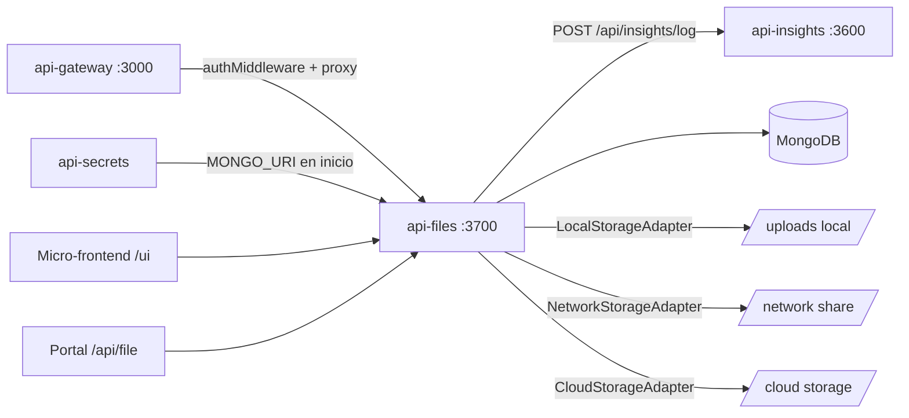

# dev-laoz-api-files

Servicio de gestion de archivos para el ecosistema Dev Laoz. Provee carga, descarga y eliminacion de archivos con versionado automatico y soporte para multiples backends de almacenamiento mediante patron adaptador (Local, Network, Cloud). Cada carga genera una nueva version manteniendo el historial completo. La eliminacion es logica (soft delete) y no borra los archivos fisicos.

## Posicion en la arquitectura



## Flujo de negocio

```mermaid
sequenceDiagram
    participant Client as Cliente HTTP
    participant API as api-files
    participant SM as StorageManager
    participant DB as MongoDB
    participant FS as File System

    Client->>API: POST /api/files (multipart, auth)
    API->>SM: getAdapter("LOCAL")
    SM->>FS: save(relativePath, buffer)
    FS-->>SM: { basePath, relativePath, fullPath }
    SM-->>API: savedMeta
    API->>DB: File.findOne({ originalName }) o new File()
    DB-->>API: fileDoc (nuevo o existente)
    API->>DB: fileDoc.versions.push(newVersion); fileDoc.save()
    API-->>Client: 201 { id, version, message }

    Note over Client,DB: Si el archivo ya existe, se crea version N+1
```

## Stack tecnico

| Componente | Tecnologia |
| --- | --- |
| Runtime | Node.js 18+ |
| Framework | Express 4 |
| Base de datos | MongoDB via Mongoose |
| Subida de archivos | Multer (multipart/form-data, in-memory buffer) |
| Almacenamiento | Patron Adaptador: LOCAL / NETWORK / CLOUD |
| Autenticacion | JWT via authMiddleware de @dev-laoz/core |
| Observabilidad | Logs a api-insights via @dev-laoz/core logger |
| Arquitectura | Clean Architecture (domain / application / infrastructure / interfaces) |

## Prerrequisitos

- Node.js >= 18
- MongoDB >= 6.0
- Directorio de uploads con permisos de escritura (`STORAGE_PATH`)
- Acceso al servicio `api-secrets` en tiempo de arranque
- Paquete `@dev-laoz/core` disponible en el registro npm del proyecto

## Variables de entorno

| Variable | Descripcion | Valor en Docker |
| --- | --- | --- |
| `PORT` | Puerto HTTP del servicio | `3700` |
| `NODE_ENV` | Entorno de ejecucion | `production` |
| `MONGO_URI` | URI de conexion a MongoDB | Inyectada por api-secrets |
| `JWT_SECRET` | Secreto para validar tokens JWT | Inyectado por api-secrets |
| `STORAGE_PATH` | Ruta base del adaptador LOCAL | `/app/uploads` |
| `RATE_LIMIT_WINDOW_MS` | Ventana de rate limiting en ms | `900000` |
| `RATE_LIMIT_MAX_REQUESTS` | Maximo de peticiones por ventana | `100` |

> `MONGO_URI` y `JWT_SECRET` son cargadas desde `api-secrets` al arrancar. En entorno local se definen directamente en `.env`.

## Instalacion y ejecucion local

```bash
# 1. Instalar dependencias
npm install

# 2. Configurar variables de entorno
cp .env .env.local
# Editar MONGO_URI y STORAGE_PATH

# 3. Iniciar en modo desarrollo
npm run dev

# 4. Verificar salud
curl http://localhost:3700/health
```

El servicio arranca en `http://localhost:3700`.

## Endpoints

| Metodo | Ruta | Auth | Descripcion |
| --- | --- | --- | --- |
| `POST` | `/api/files/content` | Si (JWT) | Guardar contenido de texto (editor) |
| `POST` | `/api/files` | Si (JWT) | Subir archivo (multipart/form-data) |
| `GET` | `/api/files/:id` | Si (JWT) | Descargar version actual del archivo |
| `GET` | `/api/files/:id/versions` | Si (JWT) | Listar todas las versiones |
| `GET` | `/api/files/:id/versions/:versionId` | Si (JWT) | Descargar version especifica |
| `PUT` | `/api/files/:id/move` | Si (JWT) | Mover archivo a otro storage |
| `POST` | `/api/files/:id/copy` | Si (JWT) | Copiar archivo a otro storage |
| `DELETE` | `/api/files/:id` | Si (JWT) | Soft delete (marca deleted=true) |
| `GET` | `/health` | No | Health check |

### Rutas adicionales

| Ruta | Descripcion |
| --- | --- |
| `/api/file/*` | Sirve contenido markdown estatico del portal de documentacion |
| `/ui` | Micro-frontend estatico |

### Modelo File (MongoDB)

```text
File
  originalName     String   (requerido)
  currentVersion   Number   (default 1)
  versions[]
    version        Number
    storageType    "LOCAL" | "NETWORK" | "CLOUD"
    basePath       String
    relativePath   String   (requerido)
    fullPath       String
    filename       String   (requerido)
    mimeType       String
    size           Number
    uploadedAt     Date
  tags             String[]
  deleted          Boolean  (default false)
  createdAt        Date
  updatedAt        Date
```

## Integracion con otros servicios

- **api-secrets**: Consultado al inicio para resolver `MONGO_URI` y secretos JWT.
- **api-insights**: Recibe logs de errores y actividad via `@dev-laoz/core` logger de forma asincrona.
- **api-gateway**: Actua como proxy para todas las peticiones externas, aplicando autenticacion previa. El `authMiddleware` valida el JWT en cada ruta `/api/files`.

## Swagger / API Docs

Swagger UI disponible en `http://localhost:3700/api-docs` cuando `ENABLE_SWAGGER=true`.

Referencia detallada de cada endpoint con esquemas y ejemplos en [`docs/API.md`](docs/API.md).
